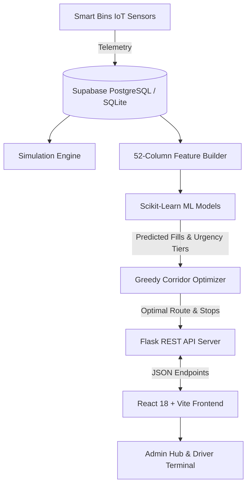

# 🚛 WasteFlow AI — Smart Predictive Waste Management & Greedy Route Optimizer

[](https://python.org)
[](https://flask.palletsprojects.com/)
[](https://reactjs.org/)
[](https://vitejs.dev/)
[](https://supabase.com)
[](https://scikit-learn.org/)
[](https://leafletjs.com/)

An end-to-end full-stack AI platform that forecasts urban waste generation rates, predicts overflow risks, and computes optimized dynamic vehicle dispatch routes using **Random Forest ML** and a **Geodesic Cross-Track Corridor Optimizer**.

---

## 🌟 Key Features

- 🧠 **Dual Machine Learning Pipeline:** 
  - **Random Forest Regressor:** 6-hour future fill percentage forecast ($R^2 \approx 0.94$).
  - **Random Forest Classifier:** Bin overflow probability with custom decision threshold ($0.6200$).
  - **52-Feature Engineering:** Diurnal cycles, rolling statistical aggregates, exponential moving averages, and weather telemetry.
- 🗺️ **Strict Geodesic Corridor Routing:**
  - Greedy nearest-neighbor tour connecting critical bins ($\ge 80\%$) from the central depot (`10.0150, 76.3450`).
  - Strict bounding box & cross-track corridor detection ($<350\text{m}$ detour) to collect medium-fill bins ($50\% - 79\%$) strictly along the driving path.
  - **48% fuel & distance savings** compared to traditional fixed municipal routes.
- ⚡ **Real-Time Urban Simulation Engine:**
  - Discrete stochastic time-advance (`+6 Hours`, `+1 Day`, `Reset Baseline`).
  - Realistic fill-rate models by zoning type (Residential, Commercial, Industrial, Market, Hospital).
- 📱 **Role-Based Interfaces & Landing Authentication:**
  - **Admin Hub:** Live interactive Leaflet map with pulsing SVG markers, analytics KPI cards, and simulation toolbar.
  - **Driver Terminal:** Mobile-first turn-by-turn stop checklist, remaining stops counter, individual stop pickups, and a **"Mark All as Completed"** bulk action button.
- ☁️ **Dual-Mode Database Layer:**
  - Live PostgreSQL on **Supabase** with seamless automatic offline SQLite fallback.

---

## 🔐 Demo Credentials

| Role | Username | Password | Default View |
| :--- | :--- | :--- | :--- |
| **Operations Admin** | `admin` | `admin` | Admin Monitoring Hub & Simulation Controls |
| **Fleet Driver** | `driver` | `driver` | Driver Route Dispatch Terminal |

---

## 🏗️ Architecture Overview



---

## 🚀 Quick Start (Local Setup)

### 1. Prerequisites
- Python 3.10+ / 3.11+
- Node.js 18+ and npm
- Git & Git LFS

### 2. Clone the Repository
```bash
git clone https://github.com/akhileswarr10/Waste-Management.git
cd Waste-Management
git lfs pull
```

### 3. Backend Setup (Flask API)
```bash
# Create and activate virtual environment (optional)
python -m venv venv
venv\Scripts\activate  # On Windows

# Install dependencies
pip install -r requirements.txt

# Run backend API server (runs on http://127.0.0.1:5000)
python backend/app.py
```

### 4. Frontend Setup (React + Vite)
```bash
cd frontend
npm install
npm run dev
```
Open **[http://localhost:5173/](http://localhost:5173/)** in your web browser.

---

## 📡 API Endpoints Reference

| Method | Endpoint | Description |
| :--- | :--- | :--- |
| `POST` | `/api/auth/login` | Authenticate Admin or Driver user session |
| `GET` | `/api/bins` | Retrieve all 20 smart bins and current fill levels |
| `GET` | `/api/predictions` | Run 52-feature ML inference & composite priority scoring |
| `GET` | `/api/routes/optimized` | Generate optimal greedy route with on-the-way corridor stops |
| `POST` | `/api/bins/<id>/collect` | Mark individual bin as collected (resets fill to $0.0\%$) |
| `POST` | `/api/routes/collect-all` | Bulk action: mark all active route stops as collected |
| `POST` | `/api/simulation/advance` | Advance virtual clock by `+6h` or `+24h` and generate telemetry |
| `POST` | `/api/simulation/reset` | Reset simulation state and re-seed clean baseline telemetry |
| `GET` | `/api/simulation/status` | Get current simulation clock time and active status |

---

## 🌐 Production Deployment

### Backend (Render / Railway)
- **Web Service Environment:** Python 3.11
- **Build Command:** `pip install -r requirements.txt`
- **Start Command:** `gunicorn backend.app:app --bind 0.0.0.0:$PORT --workers 2 --timeout 120`
- **Configuration:** Included in [`render.yaml`](render.yaml).

### Frontend (Vercel)
- **Framework Preset:** Vite
- **Root Directory:** `frontend`
- **Build Command:** `npm run build`
- **Output Directory:** `dist`
- **Environment Variables:**
  - `VITE_API_URL`: Your deployed backend URL
  - `VITE_SUPABASE_URL`: Your Supabase Project URL
  - `VITE_SUPABASE_KEY`: Your Supabase Public Anon Key

---

## 📄 License
This project is open-source and available under the [MIT License](LICENSE).
